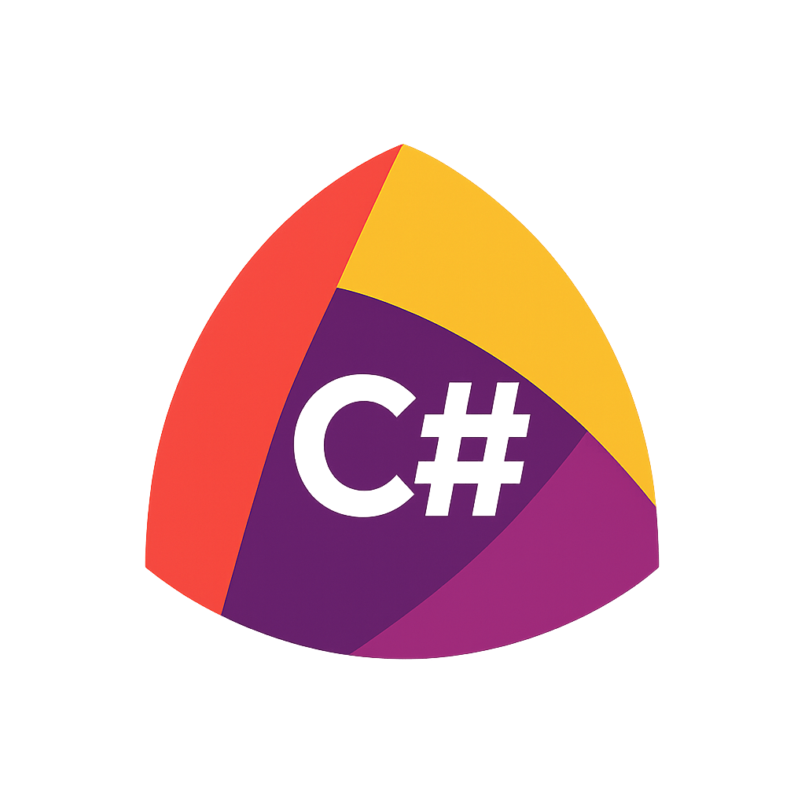
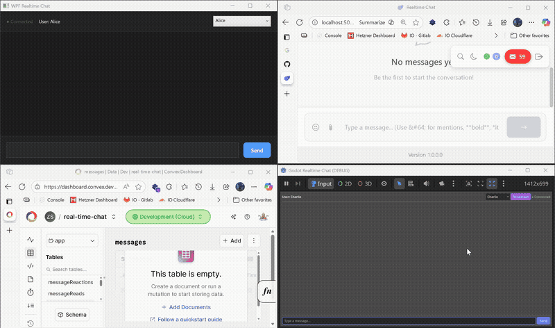

<div align="center">



# Convex .NET SDK

The .NET SDK for [Convex](https://convex.dev) - build **real-time reactive applications** with live data subscriptions, automatic synchronization, and type-safe backend queries. No WebSocket plumbing, no polling, no complexity.

[](https://www.nuget.org/packages/Convex.Client/)
[](https://github.com/zakstam/convex-dotnet-unofficial/actions)
[](https://opensource.org/licenses/MIT)


### 🎯 Supported Platforms

| Platform           | Version | Status                                                |
| ------------------ | ------- | ----------------------------------------------------- |
| **.NET Standard**  | 2.1+    | ✅ Full support                                       |
| **.NET**           | 8.0+    | ✅ Full support                                       |
| **.NET**           | 9.0+    | ✅ Full support                                       |
| **Unity**          | 2021.3+ | ✅ Compatible (via .NET Standard 2.1)                 |
| **Godot**          | 4.0+    | ✅ Compatible (via .NET Standard 2.1)                 |
| **Xamarin / MAUI** | All     | ✅ Compatible via .NET Standard 2.1                   |
| **WPF / WinForms** | All     | ✅ Full support                                       |
| **ASP.NET Core**   | 6.0+    | ✅ Full support (Extensions.AspNetCore requires 8.0+) |
| **Blazor**         | All     | ✅ Compatible                                         |
| **Console Apps**   | All     | ✅ Full support                                       |

**Target Frameworks:** `netstandard2.1`, `net8.0`, `net9.0`

---

### ⚠️ ALPHA - Community Project

**This is an ALPHA release of a community-driven Convex client for .NET.**
This project is actively maintained by the community and provides protocol compatibility with Convex.
**NOT recommended for production use yet.** API may change, breaking changes expected.

[Report Issues](https://github.com/zakstam/convex-dotnet-unofficial/issues) • [Request Features](https://github.com/zakstam/convex-dotnet-unofficial/issues/new?labels=enhancement) • [Join Discord](https://convex.dev/community)

</div>

### Demo (Second phase is running the seed script)



---

## 💡 Why This Project?

Working at a large company, I built internal software consisting of 3 frontends and 1 backend. Two of the frontends (desktop applications, not games) were created with Godot C#. Maintaining a separate backend alongside multiple frontends became increasingly complex.

**The goal:** Eliminate the backend entirely and only maintain the frontends.

With Convex as a backend-as-a-service, the .NET frontends can connect directly to Convex's real-time database - no custom backend infrastructure to deploy, scale, or maintain. This SDK makes that possible for any .NET application, whether it's Godot, Unity, WPF, Blazor, or console apps.

---

## 📑 Quick Navigation

**[Quick Start](#-quick-start)** • [Core Features](#-core-features) • [Advanced Features](#-advanced-features) • [UI Integrations](#-ui-integrations) • [Authentication](#-authentication) • [Developer Tools](#-developer-tools) • [Reference](#-reference)

**Core Features:** [Real-Time Subscriptions](#real-time-subscriptions) • [Queries & Mutations](#queries--mutations) • [Optimistic Updates](#-optimistic-updates) • [Actions](#actions)

**Advanced Features:** [File Storage](#file-storage) • [Vector Search](#vector-search) • [Scheduling](#scheduling) • [HTTP Actions](#http-actions)

**Developer Tools:** [Rx Extensions](#reactive-extensions-rx) • [Error Handling](#error-handling) • [Testing](#testing) • [Cache Management](#cache-management) • [Pagination](#pagination) • [Retry Policies](#retry-policies) • [Connection Quality](#connection-quality-monitoring) • [Middleware](#middleware)

---

## 🚀 Quick Start

Follow these steps to build your first real-time app with Convex + .NET. See the [detailed getting started guide](docs/getting-started.md) for more information.

### Step 1: Create Your Convex Backend

Write your backend functions in TypeScript (Convex's native language):

```typescript
// convex/functions/todos.ts
import { query, mutation } from "./_generated/server";
import { v } from "convex/values";

export default query({
  handler: async (ctx) => {
    return await ctx.db.query("todos").collect();
  },
});
```

```typescript
// convex/functions/createTodo.ts
import { mutation } from "./_generated/server";
import { v } from "convex/values";

export default mutation({
  args: { text: v.string() },
  handler: async (ctx, args) => {
    const id = await ctx.db.insert("todos", {
      text: args.text,
      isCompleted: false,
      createdAt: Date.now(),
    });
    return await ctx.db.get(id);
  },
});
```

### Step 2: Deploy Your Backend

```bash
# Initialize Convex project (if needed)
cd backend
npm install
npx convex dev
```

This starts the Convex development server and syncs your functions. Function names match file paths: `convex/functions/list.ts` → `"functions/list"`.

### Step 3: Install Convex.Client

```bash
dotnet add package Convex.Client
```

That's it - one package includes everything: real-time client, analyzers, and all features.

### Step 4: (Optional) Generate Type-Safe Constants

Point the source generator to your TypeScript function files for type-safe function names:

```xml
<!-- In your .csproj -->
<ItemGroup>
  <!-- Include your Convex function files (NOT api.d.ts) -->
  <AdditionalFiles Include="../backend/convex/**/*.ts" Exclude="../backend/convex/_generated/**" />
</ItemGroup>
```

Build your project - the generator creates C# constants from your TypeScript functions:

```csharp
// Auto-generated in obj/Debug/generated/Convex.SourceGenerator/ConvexFunctions.g.cs
namespace Convex.Generated
{
    public static class ConvexFunctions
    {
        public static class Queries
        {
            public const string List = "functions/list";
        }
        public static class Mutations
        {
            public const string CreateTodo = "functions/createTodo";
        }
    }
}
```

**Note:** Function names match file paths. `convex/functions/createTodo.ts` becomes `"functions/createTodo"`.

### Step 5: Generate Type-Safe C# Models (Recommended)

The source generator automatically creates C# classes, function argument types, and strongly-typed document IDs from your Convex backend.

**Configure in your `.csproj`:**

```xml
<!-- In your .csproj -->
<PropertyGroup>
  <!-- Enable strongly-typed document IDs (recommended for maximum type safety) -->
  <ConvexGenerateTypedIds>true</ConvexGenerateTypedIds>
</PropertyGroup>

<ItemGroup>
  <!-- Point to your Convex schema for model generation -->
  <AdditionalFiles Include="../backend/convex/schema.ts" />
</ItemGroup>
```

**Build your project** - the generator creates:

1. **Schema models** (`ConvexSchema.g.cs`) - C# classes for each table
2. **Function arguments** (`ConvexArgs.g.cs`) - Typed argument classes for mutations/queries
3. **Typed document IDs** (`ConvexIds.g.cs`) - Strongly-typed ID wrappers per table

```csharp
// Auto-generated schema model
namespace Convex.Generated
{
    public class Message
    {
        [JsonPropertyName("_id")]
        public MessageId Id { get; init; }  // Typed ID!

        [JsonPropertyName("text")]
        public string Text { get; init; } = default!;

        [JsonPropertyName("userId")]
        public UserId UserId { get; init; }  // References another table's ID
    }

    // Strongly-typed ID prevents mixing up IDs from different tables
    public readonly record struct MessageId(string Value)
    {
        public static implicit operator string(MessageId id) => id.Value;
        public static implicit operator MessageId(string value) => new(value);
    }

    // Auto-generated function arguments
    public sealed class SendMessageArgs
    {
        [JsonPropertyName("text")]
        public required string Text { get; init; }

        [JsonPropertyName("parentMessageId")]
        public MessageId? ParentMessageId { get; init; }  // Typed ID in args too!
    }
}
```

**Why typed IDs matter:**

```csharp
// Before: string IDs can be mixed up - compiles but wrong!
public async Task DeleteMessage(string messageId) { ... }
DeleteMessage(userId); // ⚠️ Compiles, but passes wrong ID type!

// After: compile-time safety with typed IDs
public async Task DeleteMessage(MessageId messageId) { ... }
DeleteMessage(userId); // ❌ Compile error: cannot convert UserId to MessageId
```

<details>
<summary><b>Alternative: Manual model definition</b></summary>

If you prefer not to use the generator, create C# models manually:

```csharp
public class Todo
{
    public string Id { get; set; } = "";
    public string Text { get; set; } = "";
    public bool IsCompleted { get; set; }
    public DateTime CreatedAt { get; set; }
}
```

Note: Manual models won't benefit from typed IDs or auto-generated argument types.

</details>

### Step 6: Use Real-Time Client in Your App

Connect and subscribe to live data that updates automatically:

```csharp
using Convex.Client;
using Convex.Generated; // Optional: for type-safe constants

// Simple: Direct instantiation
var client = new ConvexClient("https://your-deployment.convex.cloud");

// Or: Use builder for advanced configuration
var client = new ConvexClientBuilder()
    .UseDeployment("https://your-deployment.convex.cloud")
    .WithAutoReconnect(maxAttempts: 5)
    .WithTimeout(TimeSpan.FromSeconds(30))
    .Build();

// Full builder options available:
var client = new ConvexClientBuilder()
    .UseDeployment("https://your-deployment.convex.cloud")
    .WithHttpClient(customHttpClient)              // Custom HttpClient
    .WithTimeout(TimeSpan.FromSeconds(30))         // Default timeout
    .WithAutoReconnect(maxAttempts: 5, delayMs: 1000)  // Reconnection config
    .WithReconnectionPolicy(ReconnectionPolicy.Default())  // Or custom policy
    .WithSyncContext(SynchronizationContext.Current)  // UI thread marshalling
    .WithLogging(logger)                           // Structured logging (ILogger)
    .EnableDebugLogging()                          // Enable debug logs
    .PreConnect()                                  // Connect immediately on build
    .UseMiddleware<LoggingMiddleware>()            // Add middleware
    .WithSchemaValidation(opts => opts.StrictMode = true)  // Schema validation
    .WithRequestLogging()                          // Log all requests
    .WithDevelopmentDefaults()                     // Or: WithProductionDefaults()
    .Build();

// Subscribe to live todos - updates automatically when data changes!
client.Observe<List<Todo>>("functions/list")
    // Or: ConvexFunctions.Queries.List (if using generator)
    .Subscribe(todos =>
    {
        Console.WriteLine($"📝 {todos.Count} todos (live update!)");
        foreach (var todo in todos)
        {
            var status = todo.IsCompleted ? "✓" : " ";
            Console.WriteLine($"  [{status}] {todo.Text}");
        }
    });

// Create a new todo
await client.Mutate<Todo>("functions/createTodo")
    // Or: ConvexFunctions.Mutations.CreateTodo (if using generator)
    .WithArgs(new { text = "Learn Convex .NET" })
    .ExecuteAsync();

Console.WriteLine("Watching for changes... Press any key to exit");
Console.ReadKey();
client.Dispose();
```

**That's it!** You now have a real-time reactive app. Any changes from other clients appear instantly.

### Complete Example

Here's a complete working example:

```csharp
using Convex.Client;
using Convex.Generated; // Optional: for type-safe constants

class Program
{
    static async Task Main(string[] args)
    {
        var client = new ConvexClient("https://your-deployment.convex.cloud");

        // Subscribe to live updates
        var subscription = client.Observe<List<Todo>>("functions/list")
            // Or: ConvexFunctions.Queries.List (if using generator)
            .Subscribe(todos =>
            {
                Console.WriteLine($"\n📝 {todos.Count} todos:");
                foreach (var todo in todos)
                {
                    var status = todo.IsCompleted ? "✓" : " ";
                    Console.WriteLine($"  [{status}] {todo.Text}");
                }
            });

        // Create a new todo (using string or generated constant)
        await client.Mutate<Todo>("functions/createTodo")
            // Or: ConvexFunctions.Mutations.CreateTodo (if using generator)
            .WithArgs(new { text = "Learn Convex .NET" })
            .ExecuteAsync();

        Console.WriteLine("\nPress any key to exit...");
        Console.ReadKey();

        subscription.Dispose();
        client.Dispose();
    }
}

public class Todo
{
    public string Id { get; set; } = "";
    public string Text { get; set; } = "";
    public bool IsCompleted { get; set; }
    public DateTime CreatedAt { get; set; }
}
```

**Next Steps:** Explore [Core Features](#-core-features) below or check out [complete examples](#-examples).

---

## 🎯 Core Features

### Real-Time Subscriptions

**Problem:** You want live updates when data changes, without polling or manual refresh.

**Solution:** Use `Observe()` for automatic synchronization via WebSocket.

**Complete Example:** Live todo list that updates automatically

```csharp
using Convex.Client;

class TodoApp
{
    private ConvexClient _client;
    private IDisposable? _subscription;

    public TodoApp(string deploymentUrl)
    {
        _client = new ConvexClient(deploymentUrl);
    }

    public void Start()
    {
        // Subscribe to live todos - automatically updates when data changes!
        _subscription = _client.Observe<List<Todo>>("todos:list")
            .Subscribe(todos =>
            {
                Console.Clear();
                Console.WriteLine($"📝 {todos.Count} todos (live update!)");
                foreach (var todo in todos)
                {
                    var status = todo.IsCompleted ? "✓" : " ";
                    Console.WriteLine($"  [{status}] {todo.Text}");
                }
            });

        Console.WriteLine("Watching for changes... Press any key to exit");
    }

    public void Stop()
    {
        _subscription?.Dispose();
        _client.Dispose();
    }
}
```

**Key Points:**

- `Observe()` creates a WebSocket subscription
- Updates arrive automatically when data changes
- Always dispose subscriptions and client when done

**Learn more:** [API Reference - Real-Time Subscriptions](docs/api-reference.md#real-time-subscriptions)

### Queries & Mutations

**Problem:** You need to read and write data with type safety and error handling.

**Solution:** Use `Query()` for reads and `Mutate()` for writes with fluent API.

**Complete Example:** Todo CRUD app

```csharp
using Convex.Client;

class TodoService
{
    private readonly ConvexClient _client;

    public TodoService(ConvexClient client)
    {
        _client = client;
    }

    // Read todos - basic
    public async Task<List<Todo>> GetAllTodosAsync()
    {
        try
        {
            return await _client.Query<List<Todo>>("todos:list")
                .WithTimeout(TimeSpan.FromSeconds(5))
                .ExecuteAsync();
        }
        catch (Exception ex)
        {
            Console.WriteLine($"Error loading todos: {ex.Message}");
            return new List<Todo>();
        }
    }

    // Read todos - with all advanced options
    public async Task<List<Todo>> GetAllTodosAdvancedAsync()
    {
        return await _client.Query<List<Todo>>("todos:list")
            .WithArgs(new { userId = "123" })          // Query arguments
            .WithTimeout(TimeSpan.FromSeconds(5))      // Timeout
            .Cached(TimeSpan.FromMinutes(5))           // Cache result for 5 minutes
            .IncludeMetadata()                         // Include execution metadata
            .OnError(ex => Console.WriteLine($"Query failed: {ex.Message}"))
            .WithRetry(policy => policy
                .MaxRetries(3)
                .ExponentialBackoff(TimeSpan.FromSeconds(1))
                .WithJitter(true))
            .ExecuteAsync();
    }

    // Get result with metadata using ConvexResult<T>
    public async Task<ConvexResult<List<Todo>>> GetTodosWithResultAsync()
    {
        var result = await _client.Query<List<Todo>>("todos:list")
            .ExecuteWithResultAsync();

        if (result.IsSuccess)
            Console.WriteLine($"Got {result.Value.Count} todos");
        else
            Console.WriteLine($"Error: {result.Error?.Message}");

        return result;
    }

    // Create todo
    public async Task<Todo> CreateTodoAsync(string text)
    {
        return await _client.Mutate<Todo>("todos:create")
            .WithArgs(new { text })
            .ExecuteAsync();
    }

    // Update todo
    public async Task<Todo> UpdateTodoAsync(string id, bool completed)
    {
        return await _client.Mutate<Todo>("todos:update")
            .WithArgs(new { id, completed })
            .ExecuteAsync();
    }

    // Delete todo
    public async Task DeleteTodoAsync(string id)
    {
        await _client.Mutate<object>("todos:delete")
            .WithArgs(new { id })
            .ExecuteAsync();
    }

    // Advanced mutation with all options
    public async Task<Todo> CreateTodoAdvancedAsync(string text, ISet<string> pendingTracker)
    {
        return await _client.Mutate<Todo>("todos:create")
            .WithArgs(new { text })
            .WithTimeout(TimeSpan.FromSeconds(10))
            .OnSuccess(todo => Console.WriteLine($"Created: {todo.Id}"))
            .OnError(ex => Console.WriteLine($"Failed: {ex.Message}"))
            .WithRetry(policy => policy.MaxRetries(3).ExponentialBackoff(TimeSpan.FromSeconds(1)))
            .TrackPending(pendingTracker, text)        // Track pending mutations
            .WithCleanup(() => pendingTracker.Remove(text))  // Cleanup on completion
            .SkipQueue()                               // Bypass mutation queue (use carefully)
            .RollbackOn<InvalidOperationException>()   // Only rollback on specific exceptions
            .ExecuteAsync();
    }

    // Batch multiple queries
    public async Task<(List<Todo>, User, Stats)> GetDashboardDataAsync()
    {
        return await _client.Batch()
            .Query<List<Todo>>("todos:list")
            .Query<User>("users:current")
            .Query<Stats>("dashboard:stats")
            .ExecuteAsync<List<Todo>, User, Stats>();
    }
}
```

**Key Points:**

- Fluent API: `Query().WithArgs().ExecuteAsync()`
- Type-safe with generics
- Batch multiple queries for efficiency
- Built-in timeout and error handling
- Mutations support optimistic updates for instant UI feedback (see [Optimistic Updates](#-optimistic-updates) below)

**Query Builder Options:**

| Method | Description |
|--------|-------------|
| `WithArgs<T>(args)` | Set query arguments |
| `WithTimeout(TimeSpan)` | Set timeout |
| `Cached(TimeSpan)` | Cache result for duration |
| `IncludeMetadata()` | Include execution metadata |
| `OnError(Action<Exception>)` | Error callback |
| `WithRetry(policy)` | Configure retry policy |
| `ExecuteAsync()` | Execute and return result |
| `ExecuteWithResultAsync()` | Execute and return `ConvexResult<T>` |

**Mutation Builder Options:**

| Method | Description |
|--------|-------------|
| `WithArgs<T>(args)` | Set mutation arguments |
| `WithTimeout(TimeSpan)` | Set timeout |
| `Optimistic(Action<T>)` | Optimistic update callback |
| `OptimisticWithAutoRollback()` | Auto-rollback on failure |
| `WithOptimisticUpdate()` | Query-focused optimistic update |
| `UpdateCache<T>()` | Update cached query result |
| `WithRollback(Action)` | Manual rollback action |
| `RollbackOn<TException>()` | Rollback only on specific exception |
| `OnSuccess(Action<T>)` | Success callback |
| `OnError(Action<Exception>)` | Error callback |
| `WithRetry(policy)` | Configure retry policy |
| `SkipQueue()` | Bypass mutation queue |
| `TrackPending(tracker, key)` | Track pending mutations |
| `WithCleanup(Action)` | Cleanup action on completion |
| `ExecuteAsync()` | Execute and return result |
| `ExecuteWithResultAsync()` | Execute and return `ConvexResult<T>` |

**Learn more:** [API Reference - Queries & Mutations](docs/api-reference.md#queries)

### Optimistic Updates

**Problem:** You want instant UI feedback when mutations execute, without waiting for the server response.

**Solution:** Use optimistic updates to immediately update the UI before the server responds. If the mutation fails, updates are automatically rolled back.

**Complete Example:** Optimistic updates for instant feedback

```csharp
using Convex.Client;

class TodoService
{
    private readonly ConvexClient _client;
    private List<Todo> _todos = new();

    public TodoService(ConvexClient client)
    {
        _client = client;
    }

    // Method 1: Simple optimistic update with callback (recommended for simple cases)
    public async Task<Todo> CreateTodoOptimisticAsync(string text)
    {
        return await _client.Mutate<Todo>("todos:create")
            .WithArgs(new { text })
            .Optimistic(result =>
            {
                // Update UI immediately with the expected result
                _todos.Add(result);
                UpdateUI();
            })
            .WithRollback(() =>
            {
                // Restore original state if mutation fails
                _todos.RemoveAll(t => t.Text == text);
                UpdateUI();
            })
            .ExecuteAsync();
    }

    // Method 2: Optimistic update with automatic rollback (recommended)
    public async Task<Todo> CreateTodoWithAutoRollbackAsync(string text)
    {
        return await _client.Mutate<Todo>("todos:create")
            .WithArgs(new { text })
            .OptimisticWithAutoRollback(
                getter: () => _todos.ToList(), // Capture current state
                setter: value => { _todos = value; UpdateUI(); }, // Update state
                update: todos => todos.Append(new Todo { Text = text, Id = "temp" }).ToList() // Optimistic change
            )
            .ExecuteAsync();
    }

    // Method 3: Query-focused optimistic updates (convex-js style)
    public async Task<Message> SendMessageOptimisticAsync(string text)
    {
        return await _client.Mutate<Message>("messages:send")
            .WithArgs(new { text })
            .WithOptimisticUpdate((localStore, args) =>
            {
                // Update query results directly
                var currentMessages = localStore.GetQuery<List<Message>>("messages:list") ?? new List<Message>();
                var optimisticMessage = new Message 
                { 
                    Id = Guid.NewGuid().ToString(), 
                    Text = args.text,
                    CreatedAt = DateTime.UtcNow 
                };
                localStore.SetQuery("messages:list", currentMessages.Append(optimisticMessage).ToList());
            })
            .ExecuteAsync();
    }

    // Method 4: Update cached query result optimistically
    public async Task<Todo> ToggleTodoOptimisticAsync(string id, bool completed)
    {
        return await _client.Mutate<Todo>("todos:toggle")
            .WithArgs(new { id, completed })
            .UpdateCache<List<Todo>>("todos:list", todos =>
            {
                // Optimistically update the cached query result
                return todos.Select(t => t.Id == id ? new Todo 
                { 
                    Id = t.Id, 
                    Text = t.Text, 
                    IsCompleted = completed,
                    CreatedAt = t.CreatedAt 
                } : t).ToList();
            })
            .ExecuteAsync();
    }

    private void UpdateUI()
    {
        // Trigger UI refresh
    }
}
```

**Key Points:**

- **`Optimistic()`** - Simple callback that runs immediately with the expected result
- **`OptimisticWithAutoRollback()`** - Recommended approach: automatically captures and restores state on failure
- **`WithOptimisticUpdate()`** - Query-focused updates matching convex-js pattern (operates on query results)
- **`UpdateCache()`** - Optimistically update cached query results before mutation completes
- Automatic rollback on mutation failure
- Optimistic updates are NOT re-applied during retries to avoid duplicate updates

**When to use each approach:**

- Use **`OptimisticWithAutoRollback()`** for most cases - it handles rollback automatically
- Use **`Optimistic()`** with **`WithRollback()`** when you need custom rollback logic
- Use **`WithOptimisticUpdate()`** when you want to match convex-js's query-focused pattern
- Use **`UpdateCache()`** when you want to update cached query subscriptions optimistically

**Learn more:** [API Reference - Optimistic Updates](docs/api-reference.md#mutations)

### Actions

**Problem:** You need to call external APIs or perform server-side operations.

**Solution:** Use `Action()` for side effects and external integrations.

**Complete Example:** Sending email action

```csharp
using Convex.Client;

class EmailService
{
    private readonly ConvexClient _client;

    public EmailService(ConvexClient client)
    {
        _client = client;
    }

    public async Task<string> SendWelcomeEmailAsync(string userId)
    {
        try
        {
            var result = await _client.Action<string>("emails:sendWelcome")
                .WithArgs(new
                {
                    userId,
                    template = "welcome",
                    subject = "Welcome to our app!"
                })
                .WithTimeout(TimeSpan.FromSeconds(30))
                .ExecuteAsync();

            Console.WriteLine($"Email sent: {result}");
            return result;
        }
        catch (Exception ex)
        {
            Console.WriteLine($"Failed to send email: {ex.Message}");
            throw;
        }
    }
}
```

**Key Points:**

- Actions can access external APIs
- Use for operations that aren't pure database operations
- Supports longer timeouts for external calls

**Action Builder Options:**

| Method | Description |
|--------|-------------|
| `WithArgs<T>(args)` | Set action arguments |
| `WithTimeout(TimeSpan)` | Set timeout |
| `OnSuccess(Action<T>)` | Success callback |
| `OnError(Action<Exception>)` | Error callback |
| `WithRetry(policy)` | Configure retry policy |
| `ExecuteAsync()` | Execute and return result |
| `ExecuteWithResultAsync()` | Execute and return `ConvexResult<T>` |

**Learn more:** [API Reference - Actions](docs/api-reference.md#actions)

---

## 🚀 Advanced Features

### File Storage

**Problem:** You need to upload and serve files (images, documents, etc.).

**Solution:** Use `Files` for file operations.

**Complete Example:** Upload profile picture and display it

```csharp
using Convex.Client;

class ProfileService
{
    private readonly IConvexClient _client;

    public ProfileService(IConvexClient client)
    {
        _client = client;
    }

    public async Task<string> UploadProfilePictureAsync(Stream imageStream, string filename)
    {
        // Upload file
        var storageId = await _client.Files.UploadFileAsync(
            imageStream,
            contentType: "image/jpeg",
            filename: filename
        );

        Console.WriteLine($"Uploaded: {storageId}");
        return storageId;
    }

    public async Task<string> GetProfilePictureUrlAsync(string storageId)
    {
        // Get download URL
        var url = await _client.Files.GetDownloadUrlAsync(storageId);
        return url;
    }

    public async Task<Stream> DownloadProfilePictureAsync(string storageId)
    {
        // Download file directly
        return await _client.Files.DownloadFileAsync(storageId);
    }

    public async Task<FileMetadata> GetFileInfoAsync(string storageId)
    {
        // Get file metadata (size, content type, etc.)
        return await _client.Files.GetFileMetadataAsync(storageId);
    }

    public async Task<string> UploadWithSeparateUrlAsync(Stream imageStream)
    {
        // Two-step upload: generate URL first, then upload
        var uploadUrl = await _client.Files.GenerateUploadUrlAsync("profile.jpg");
        var storageId = await _client.Files.UploadFileAsync(
            uploadUrl,
            imageStream,
            contentType: "image/jpeg",
            filename: "profile.jpg"
        );
        return storageId;
    }
}
```

**Key Points:**

- Upload returns a storage ID
- Get download URL for browser display
- Download directly for server processing

**File Storage Methods:**

| Method | Description |
|--------|-------------|
| `GenerateUploadUrlAsync(filename)` | Get a pre-signed upload URL |
| `UploadFileAsync(url, stream, contentType, filename)` | Upload using pre-signed URL |
| `UploadFileAsync(stream, contentType, filename)` | Combined URL generation + upload |
| `DownloadFileAsync(storageId)` | Download file as Stream |
| `GetDownloadUrlAsync(storageId)` | Get temporary download URL |
| `GetFileMetadataAsync(storageId)` | Get file metadata (size, type, etc.) |

**Learn more:** [API Reference - File Storage](docs/api-reference.md#file-storage)

### Vector Search

**Problem:** You need AI-powered semantic search over your data.

**Solution:** Use `VectorSearch` for similarity search.

**Complete Example:** Product search with embeddings

```csharp
using Convex.Client;

class ProductSearchService
{
    private readonly IConvexClient _client;

    public ProductSearchService(IConvexClient client)
    {
        _client = client;
    }

    public async Task<List<Product>> SearchSimilarProductsAsync(float[] queryEmbedding)
    {
        try
        {
            var results = await _client.VectorSearch.SearchAsync<Product>(
                indexName: "product_embeddings",
                vector: queryEmbedding,
                limit: 10
            );

            var products = new List<Product>();
            foreach (var result in results)
            {
                Console.WriteLine($"{result.Item.Name} (similarity: {result.Score:F3})");
                products.Add(result.Item);
            }

            return products;
        }
        catch (Exception ex)
        {
            Console.WriteLine($"Search failed: {ex.Message}");
            return new List<Product>();
        }
    }

    // Search by text (auto-generates embedding)
    public async Task<List<Product>> SearchByTextAsync(string searchText)
    {
        var results = await _client.VectorSearch.SearchByTextAsync<Product>(
            indexName: "product_embeddings",
            text: searchText,
            embeddingModel: "text-embedding-ada-002",
            limit: 10
        );

        return results.Select(r => r.Item).ToList();
    }

    // Search with filter
    public async Task<List<Product>> SearchWithFilterAsync(float[] queryEmbedding, string category)
    {
        var results = await _client.VectorSearch.SearchAsync<Product, object>(
            indexName: "product_embeddings",
            vector: queryEmbedding,
            limit: 10,
            filter: new { category }
        );

        return results.Select(r => r.Item).ToList();
    }

    // Create embedding from text
    public async Task<float[]> CreateEmbeddingAsync(string text)
    {
        return await _client.VectorSearch.CreateEmbeddingAsync(
            text: text,
            model: "text-embedding-ada-002"
        );
    }
}
```

**Key Points:**

- Requires pre-computed embeddings
- Returns results with similarity scores
- Use for semantic search, recommendations, etc.

**Vector Search Methods:**

| Method | Description |
|--------|-------------|
| `SearchAsync<T>(index, vector, limit)` | Search by vector embedding |
| `SearchAsync<T, TFilter>(index, vector, limit, filter)` | Search with filter |
| `SearchByTextAsync<T>(index, text, model, limit)` | Search by text (auto-embed) |
| `SearchByTextAsync<T, TFilter>(index, text, limit, filter)` | Search by text with filter |
| `CreateEmbeddingAsync(text, model)` | Create embedding from text |

**Learn more:** [API Reference - Vector Search](docs/api-reference.md#vector-search)

### Scheduling

**Problem:** You need to run functions at specific times or intervals.

**Solution:** Use `Scheduler` for delayed and recurring jobs.

**Complete Example:** Reminder system

```csharp
using Convex.Client;

class ReminderService
{
    private readonly IConvexClient _client;

    public ReminderService(IConvexClient client)
    {
        _client = client;
    }

    public async Task<string> ScheduleReminderAsync(string userId, DateTime reminderTime)
    {
        var delay = reminderTime - DateTime.UtcNow;

        // Schedule one-time reminder
        var jobId = await _client.Scheduler.ScheduleAsync(
            functionName: "reminders:send",
            delay: delay,
            args: new { userId }
        );

        Console.WriteLine($"Reminder scheduled: {jobId}");
        return jobId;
    }

    public async Task<string> ScheduleDailyDigestAsync(string userId)
    {
        // Schedule recurring daily digest at 9 AM
        var jobId = await _client.Scheduler.ScheduleRecurringAsync(
            functionName: "emails:sendDailyDigest",
            cronExpression: "0 9 * * *", // Daily at 9 AM
            timezone: "America/New_York",
            args: new { userId }
        );

        return jobId;
    }

    public async Task CancelReminderAsync(string jobId)
    {
        var cancelled = await _client.Scheduler.CancelAsync(jobId);
        if (cancelled)
        {
            Console.WriteLine($"Reminder cancelled: {jobId}");
        }
    }

    // Schedule at specific time
    public async Task<string> ScheduleAtExactTimeAsync(string userId, DateTimeOffset scheduledTime)
    {
        return await _client.Scheduler.ScheduleAtAsync(
            functionName: "reminders:send",
            scheduledTime: scheduledTime,
            args: new { userId }
        );
    }

    // Schedule recurring at interval
    public async Task<string> ScheduleIntervalAsync(string userId)
    {
        return await _client.Scheduler.ScheduleIntervalAsync(
            functionName: "sync:heartbeat",
            interval: TimeSpan.FromMinutes(5),
            args: new { userId },
            startTime: DateTimeOffset.UtcNow,
            endTime: DateTimeOffset.UtcNow.AddDays(30)
        );
    }
}
```

**Key Points:**

- Schedule one-time, recurring (cron), or interval jobs
- Returns job ID for cancellation
- Supports timezone-aware scheduling

**Scheduler Methods:**

| Method | Description |
|--------|-------------|
| `ScheduleAsync(fn, delay)` | Schedule after delay |
| `ScheduleAsync<T>(fn, delay, args)` | Schedule after delay with args |
| `ScheduleAtAsync(fn, time)` | Schedule at specific time |
| `ScheduleAtAsync<T>(fn, time, args)` | Schedule at time with args |
| `ScheduleRecurringAsync(fn, cron, timezone)` | Schedule with cron expression |
| `ScheduleRecurringAsync<T>(fn, cron, args, timezone)` | Schedule cron with args |
| `ScheduleIntervalAsync(fn, interval)` | Schedule at fixed interval |
| `ScheduleIntervalAsync<T>(fn, interval, args, start?, end?)` | Schedule interval with args |
| `CancelAsync(jobId)` | Cancel scheduled job |

**Learn more:** [API Reference - Scheduling](docs/api-reference.md#scheduling)

### HTTP Actions

**Problem:** You need to call REST endpoints built with Convex HTTP Actions.

**Solution:** Use `Http` for HTTP requests.

**Complete Example:** REST API integration

```csharp
using Convex.Client;
using System.Collections.Generic;

class ApiClient
{
    private readonly IConvexClient _client;

    public ApiClient(IConvexClient client)
    {
        _client = client;
    }

    public async Task<User?> GetUserAsync(string userId)
    {
        // GET request
        var response = await _client.Http.GetAsync<User>(
            actionPath: $"users/{userId}",
            queryParameters: new Dictionary<string, string> { ["include"] = "profile" }
        );

        if (response.IsSuccess)
        {
            return response.Body;
        }

        Console.WriteLine($"Failed: {response.StatusCode}");
        return null;
    }

    public async Task<User> CreateUserAsync(User newUser)
    {
        // POST request with body
        var response = await _client.Http.PostAsync<User, User>(
            actionPath: "users",
            body: newUser
        );

        if (response.IsSuccess)
        {
            return response.Body!;
        }

        throw new Exception($"Failed to create user: {response.StatusCode}");
    }

    public async Task<User> UpdateUserAsync(string userId, User updatedUser)
    {
        // PUT request
        var response = await _client.Http.PutAsync<User, User>(
            endpoint: $"users/{userId}",
            body: updatedUser
        );

        return response.IsSuccess ? response.Body! : throw new Exception("Update failed");
    }

    public async Task<User> PatchUserAsync(string userId, object partialUpdate)
    {
        // PATCH request for partial updates
        var response = await _client.Http.PatchAsync<User, object>(
            endpoint: $"users/{userId}",
            body: partialUpdate
        );

        return response.IsSuccess ? response.Body! : throw new Exception("Patch failed");
    }

    public async Task DeleteUserAsync(string userId)
    {
        // DELETE request
        await _client.Http.DeleteAsync(endpoint: $"users/{userId}");
    }
}
```

**Key Points:**

- Full REST support: GET, POST, PUT, PATCH, DELETE
- Type-safe request/response handling
- Check `IsSuccess` before using response body

**HTTP Action Methods:**

| Method | Description |
|--------|-------------|
| `GetAsync<T>(endpoint)` | HTTP GET request |
| `PostAsync<T>(endpoint)` | HTTP POST without body |
| `PostAsync<T, TBody>(endpoint, body)` | HTTP POST with body |
| `PutAsync<T>(endpoint)` | HTTP PUT without body |
| `PutAsync<T, TBody>(endpoint, body)` | HTTP PUT with body |
| `PatchAsync<T>(endpoint)` | HTTP PATCH without body |
| `PatchAsync<T, TBody>(endpoint, body)` | HTTP PATCH with body |
| `DeleteAsync(endpoint)` | HTTP DELETE request |

**Learn more:** [API Reference - HTTP Actions](docs/api-reference.md#http-actions)

---

## 🎨 UI Integrations

### Blazor

**Problem:** You want real-time data in Blazor components with automatic UI updates.

**Solution:** Use Blazor extensions for StateHasChanged integration and form binding.

**Complete Example:** Blazor component with real-time data

```csharp
@page "/todos"
@using Convex.Client
@using Convex.Client.Extensions.ExtensionMethods
@inject IConvexClient Client
@implements IDisposable

<h3>Todo List (Live Updates)</h3>

@if (todos == null)
{
    <p>Loading...</p>
}
else
{
    <ul>
        @foreach (var todo in todos)
        {
            <li>
                <input type="checkbox" checked="@todo.IsCompleted" />
                @todo.Text
            </li>
        }
    </ul>
}

@code {
    private List<Todo>? todos;
    private IDisposable? subscription;

    protected override void OnInitialized()
    {
        // Subscribe with automatic StateHasChanged
        subscription = Client.Observe<List<Todo>>("todos:list")
            .SubscribeWithStateHasChanged(this, newTodos =>
            {
                todos = newTodos;
                StateHasChanged(); // Trigger UI update
            });
    }

    public void Dispose()
    {
        subscription?.Dispose();
    }
}
```

**Key Points:**

- `SubscribeWithStateHasChanged()` handles component lifecycle
- `BindToForm()` for two-way form binding
- `ToAsyncEnumerable()` for async streaming

**Learn more:** Install `Convex.Client.Blazor` package

### WPF / MAUI

**Problem:** You want reactive data binding in MVVM applications.

**Solution:** Use WPF/MAUI extensions for ObservableCollection and property binding.

**Complete Example:** MVVM app with ObservableCollection

```csharp
using Convex.Client;
using Convex.Client.Extensions.ExtensionMethods;
using System.Collections.ObjectModel;

class TodoViewModel : INotifyPropertyChanged
{
    private readonly ConvexClient _client;
    private IDisposable? _subscription;

    public TodoViewModel(ConvexClient client)
    {
        _client = client;
        Todos = new ObservableCollection<Todo>();
    }

    public ObservableCollection<Todo> Todos { get; }

    public void Start()
    {
        // Auto-sync ObservableCollection
        _subscription = _client.Observe<List<Todo>>("todos:list")
            .ObserveOnUI() // Marshal to UI thread
            .ToObservableCollection()
            .Subscribe(collection =>
            {
                Todos.Clear();
                foreach (var todo in collection)
                {
                    Todos.Add(todo);
                }
            });

        // Bind connection state to command
        _client.ConnectionStateChanges
            .Select(state => state == ConnectionState.Connected)
            .ObserveOnUI()
            .BindToCanExecute(SaveCommand); // Enable/disable command
    }

    public void Stop()
    {
        _subscription?.Dispose();
    }
}
```

**Key Points:**

- `ObserveOnUI()` ensures thread safety
- `ToObservableCollection()` for automatic updates
- `BindToProperty()` and `BindToCanExecute()` for reactive binding

**Learn more:** These extensions are included in `Convex.Client`

### ASP.NET Core

**Problem:** You need server-side Convex client with dependency injection and health checks.

**Solution:** Use ASP.NET Core extensions for middleware and DI.

**Complete Example:** Server-side API with middleware

```csharp
// Program.cs
using Convex.Client.Extensions.DependencyInjection;
using Convex.Client.AspNetCore;

var builder = WebApplication.CreateBuilder(args);

// Add Convex client with DI
builder.Services.AddConvex(options =>
{
    options.DeploymentUrl = builder.Configuration["Convex:DeploymentUrl"];
});

// Add health checks
builder.Services.AddHealthChecks()
    .AddConvexHealthCheck();

var app = builder.Build();

// Use Convex auth middleware
app.UseConvexAuth();

// Use health checks
app.MapHealthChecks("/health");

// Use in controllers
app.MapGet("/todos", async (IConvexClient client) =>
{
    var todos = await client.Query<List<Todo>>("todos:list")
        .ExecuteAsync();
    return Results.Ok(todos);
});

app.Run();
```

**Key Points:**

- Dependency injection for `IConvexClient`
- Middleware for authentication token handling
- Health checks for monitoring

**Learn more:** Install `Convex.Client.AspNetCore` package

---

## 🔐 Authentication

### Token Management

**Problem:** You need secure authentication with token refresh.

**Solution:** Use token providers for automatic token management.

**Complete Example:** Auth flow with token refresh

```csharp
using Convex.Client;
using Convex.Client.Features.Security.Authentication;

class AuthService
{
    private readonly IConvexClient _client;
    private readonly IAuthenticationService _authService;

    public AuthService(IConvexClient client, IAuthenticationService authService)
    {
        _client = client;
        _authService = authService;
    }

    public async Task InitializeAsync()
    {
        // Use token provider for automatic refresh
        var provider = new AuthTokenProvider(_authService);
        await _client.Auth.SetAuthTokenProviderAsync(provider);
    }

    // For simple apps or testing
    public async Task SetStaticTokenAsync(string token)
    {
        await _client.Auth.SetAuthTokenAsync(token);
    }

    // Clear authentication
    public async Task LogoutAsync()
    {
        await _client.Auth.ClearAuthAsync();
    }

    // Get current auth state
    public async Task<AuthenticationState> GetCurrentStateAsync()
    {
        return await _client.Auth.GetAuthStateAsync();
    }

    // Subscribe to auth state changes
    public void SubscribeToAuthChanges()
    {
        _client.Auth.AuthenticationStateChanged += (sender, state) =>
        {
            Console.WriteLine($"Auth state changed: {state}");
        };

        // Or use the observable
        _client.AuthenticationStateChanges.Subscribe(state =>
        {
            Console.WriteLine($"Auth state: {state}");
        });
    }
}

class AuthTokenProvider : IAuthTokenProvider
{
    private readonly IAuthenticationService _authService;

    public AuthTokenProvider(IAuthenticationService authService)
    {
        _authService = authService;
    }

    public async Task<string?> GetTokenAsync(CancellationToken cancellationToken = default)
    {
        // Refresh token if needed
        return await _authService.GetValidTokenAsync();
    }
}
```

**Key Points:**

- Token provider pattern for automatic refresh
- Static token for simple apps/testing
- Admin auth for server-side only

**Authentication Methods:**

| Method | Description |
|--------|-------------|
| `SetAuthTokenAsync(token)` | Set JWT authentication token |
| `SetAdminAuthAsync(adminKey)` | Set admin key (server-side only) |
| `SetAuthTokenProviderAsync(provider)` | Set token provider for auto-refresh |
| `ClearAuthAsync()` | Clear authentication |
| `GetAuthStateAsync()` | Get current auth state |
| `AuthenticationStateChanged` (event) | Subscribe to state changes |
| `CurrentAuthToken` (property) | Get current token |
| `AuthenticationState` (property) | Get current state |

**Authentication States:**

| State | Description |
|-------|-------------|
| `Unauthenticated` | No authentication set |
| `Authenticating` | Authentication in progress |
| `Authenticated` | Successfully authenticated |
| `TokenExpired` | Token has expired |
| `AuthenticationFailed` | Authentication failed |

**Learn more:** [API Reference - Authentication](docs/api-reference.md#authentication)

### Clerk Integration

**Problem:** You're using Clerk for authentication and want seamless integration.

**Solution:** Use `Convex.Client.Blazor` which includes Clerk authentication support.

**Complete Example:** Blazor app with Clerk

```bash
# Install Blazor package (includes Clerk support)
dotnet add package Convex.Client.Blazor
```

```csharp
// Program.cs
using Convex.Client.Blazor;

var builder = WebApplication.CreateBuilder(args);

// Add Convex with Clerk integration
builder.Services.AddConvexWithClerk(options =>
{
    options.DeploymentUrl = builder.Configuration["Convex:DeploymentUrl"];
});

var app = builder.Build();
app.Run();
```

**Key Points:**

- Zero-configuration setup for Blazor WebAssembly
- Automatic JavaScript injection
- Token management handled automatically

**Learn more:** See [Convex.Client.Blazor README](src/Convex.Client.Blazor/README.md)

---

## 🛠️ Developer Tools

### Reactive Extensions (Rx)

**Problem:** You need advanced observable patterns like debouncing, retry, and circuit breakers.

**Solution:** Use Rx extension methods for common patterns.

**Complete Example:** Debounced search with retry

```csharp
using Convex.Client.Extensions.ExtensionMethods;
using System.Reactive.Subjects;

class SearchService
{
    private readonly ConvexClient _client;
    private readonly Subject<string> _searchText = new();

    public SearchService(ConvexClient client)
    {
        _client = client;
    }

    public void SetupSearch()
    {
        // Debounced search with retry
        _searchText
            .SmartDebounce(TimeSpan.FromMilliseconds(300))
            .SelectMany(term => _client.Observe<List<Product>, object>("products:search", new { term }))
            .RetryWithBackoff(maxRetries: 3, initialDelay: TimeSpan.FromSeconds(1))
            .Subscribe(results =>
            {
                UpdateSearchResults(results);
            });
    }

    public void OnSearchTextChanged(string text)
    {
        _searchText.OnNext(text);
    }
}
```

**Key Points:**

- `SmartDebounce()` preserves first and last values
- `RetryWithBackoff()` for automatic retry
- `ShareReplayLatest()` for multiple subscribers

**Learn more:** These Rx extensions are included in `Convex.Client`

### Error Handling

**Problem:** You need resilient subscriptions that handle network issues gracefully.

**Solution:** Use error handling patterns like circuit breakers and conditional retry.

**Complete Example:** Resilient subscription with circuit breaker

```csharp
using Convex.Client.Extensions.ExtensionMethods;

class ResilientDataService
{
    private readonly ConvexClient _client;

    public ResilientDataService(ConvexClient client)
    {
        _client = client;
    }

    public void SetupResilientSubscription()
    {
        // Resilient subscription with circuit breaker
        _client.Observe<List<Todo>>("todos:list")
            .RetryWhen(ex => ex is ConvexNetworkException, maxRetries: 5)
            .WithCircuitBreaker(
                failureThreshold: 5,
                recoveryTimeout: TimeSpan.FromMinutes(1))
            .CatchAndReport(
                () => new { Timestamp = DateTime.UtcNow },
                (ex, context) => Console.WriteLine($"Error at {context.Timestamp}: {ex.Message}"))
            .Subscribe(todos => UpdateUI(todos));
    }
}
```

**Key Points:**

- `RetryWhen()` for conditional retry
- `WithCircuitBreaker()` prevents cascading failures
- `CatchAndReport()` for error logging

**Learn more:** These error handling extensions are included in `Convex.Client`. See [API Reference - Extension Methods](docs/api-reference.md#extension-methods)

### Testing

**Problem:** You need to test code that uses Convex client without hitting the real backend.

**Solution:** Use testing utilities to create mock clients.

**Complete Example:** Unit test with mock client

```csharp
using Convex.Client.Extensions.ExtensionMethods;
using Xunit;

public class TodoServiceTests
{
    [Fact]
    public async Task GetAllTodos_ReturnsTodos()
    {
        // Create mock client
        var mockClient = ConvexTestingExtensions.CreateMockClient(builder =>
            builder.SetupQuery("todos:list", new List<Todo>
            {
                new Todo { Id = "1", Text = "Test todo" }
            }));

        var service = new TodoService(mockClient);
        var todos = await service.GetAllTodosAsync();

        Assert.Single(todos);
        Assert.Equal("Test todo", todos[0].Text);
    }

    [Fact]
    public async Task ObserveTodos_EmitsValues()
    {
        var mockClient = ConvexTestingExtensions.CreateMockClient(builder =>
            builder.SetupQuery("todos:list", new List<Todo>()));

        var recorder = mockClient.Observe<List<Todo>>("todos:list")
            .Record();

        // Wait for value
        await recorder.WaitForValue(todos => todos.Count > 0, timeout: TimeSpan.FromSeconds(5));

        Assert.True(recorder.Values.Count > 0);
    }
}
```

**Key Points:**

- `CreateMockClient()` for testing
- `Record()` to capture observable emissions
- `WaitForValue()` for async testing

**Learn more:** These testing utilities are included in `Convex.Client`

### Cache Management

**Problem:** You need direct control over the client-side cache for query results.

**Solution:** Use the `Cache` property to manage cached data.

**Complete Example:** Cache manipulation

```csharp
using Convex.Client;

class CacheService
{
    private readonly IConvexClient _client;

    public CacheService(IConvexClient client)
    {
        _client = client;
    }

    public void ManageCache()
    {
        // Get cached value
        var todos = _client.Cache.Get<List<Todo>>("todos:list");

        // Try get (safer - doesn't throw)
        if (_client.Cache.TryGet<List<Todo>>("todos:list", out var cachedTodos))
        {
            Console.WriteLine($"Found {cachedTodos.Count} cached todos");
        }

        // Set cache value manually
        _client.Cache.Set("todos:list", new List<Todo>());

        // Remove specific cache entry
        _client.Cache.Remove("todos:list");

        // Remove by pattern (supports wildcards)
        _client.Cache.RemovePattern("todos:*");

        // Clear all cache
        _client.Cache.Clear();
    }

    // Invalidate queries (triggers re-fetch)
    public async Task InvalidateAsync()
    {
        // Invalidate specific query
        await _client.InvalidateQueryAsync("todos:list");

        // Invalidate by pattern
        await _client.InvalidateQueriesAsync("todos:*");
    }

    // Define mutation dependencies (auto-invalidate on mutation)
    public void SetupDependencies()
    {
        _client.DefineQueryDependency("todos:create", "todos:list", "todos:count");
        _client.DefineQueryDependency("todos:delete", "todos:list", "todos:count");
    }
}
```

**Cache Methods:**

| Method | Description |
|--------|-------------|
| `Cache.Get<T>(key)` | Get cached value by key |
| `Cache.TryGet<T>(key, out value)` | Try get cached value (safer) |
| `Cache.Set<T>(key, value)` | Set cache value |
| `Cache.Remove(key)` | Remove cache entry |
| `Cache.RemovePattern(pattern)` | Remove by pattern (wildcards) |
| `Cache.Clear()` | Clear all cache |
| `InvalidateQueryAsync(name)` | Invalidate and re-fetch query |
| `InvalidateQueriesAsync(pattern)` | Invalidate queries by pattern |
| `DefineQueryDependency(mutation, queries...)` | Auto-invalidate on mutation |

### Pagination

**Problem:** You need to efficiently load large datasets in pages.

**Solution:** Use cursor-based pagination with the `Pagination` property.

**Complete Example:** Paginated data loading

```csharp
using Convex.Client;

class PaginatedDataService
{
    private readonly IConvexClient _client;

    public PaginatedDataService(IConvexClient client)
    {
        _client = client;
    }

    public async Task LoadPaginatedDataAsync()
    {
        var paginator = _client.Pagination.Query<Message>("messages:list");

        // Load first page
        var firstPage = await paginator.LoadFirstPageAsync(pageSize: 20);
        Console.WriteLine($"Loaded {firstPage.Items.Count} messages");

        // Check if more pages available
        if (firstPage.HasMore)
        {
            // Load next page using cursor
            var nextPage = await paginator.LoadNextPageAsync(firstPage.Cursor);
            Console.WriteLine($"Loaded {nextPage.Items.Count} more messages");
        }

        // Or iterate through all pages
        await foreach (var page in paginator.GetPagesAsync(pageSize: 20))
        {
            foreach (var message in page.Items)
            {
                Console.WriteLine(message.Text);
            }
        }
    }
}
```

### Retry Policies

**Problem:** You need fine-grained control over retry behavior for failed operations.

**Solution:** Configure retry policies with exponential backoff, jitter, and conditional retry.

**Complete Example:** Custom retry policies

```csharp
using Convex.Client;
using Convex.Client.Infrastructure.Resilience;

class RetryService
{
    private readonly ConvexClient _client;

    public RetryService(ConvexClient client)
    {
        _client = client;
    }

    public async Task ExecuteWithRetryAsync()
    {
        // Use predefined policies
        await _client.Query<List<Todo>>("todos:list")
            .WithRetry(RetryPolicy.Default())      // 3 retries, exponential backoff
            .ExecuteAsync();

        await _client.Query<List<Todo>>("todos:list")
            .WithRetry(RetryPolicy.Aggressive())   // 5 retries, shorter delays
            .ExecuteAsync();

        await _client.Query<List<Todo>>("todos:list")
            .WithRetry(RetryPolicy.Conservative()) // 2 retries, longer delays
            .ExecuteAsync();

        // Build custom policy
        await _client.Query<List<Todo>>("todos:list")
            .WithRetry(policy => policy
                .MaxRetries(5)
                .ExponentialBackoff(TimeSpan.FromMilliseconds(100))
                .WithBackoffMultiplier(2.0)
                .WithMaxDelay(TimeSpan.FromSeconds(30))
                .WithJitter(true)                  // Add randomness to prevent thundering herd
                .RetryOn<TimeoutException>()       // Only retry on specific exceptions
                .RetryOnTransient())               // Retry on transient errors
            .ExecuteAsync();
    }
}
```

**Retry Policy Options:**

| Method | Description |
|--------|-------------|
| `MaxRetries(count)` | Maximum retry attempts |
| `ExponentialBackoff(initialDelay)` | Exponential backoff strategy |
| `LinearBackoff(initialDelay)` | Linear backoff strategy |
| `ConstantBackoff(delay)` | Fixed delay between retries |
| `WithBackoffMultiplier(multiplier)` | Multiplier for exponential backoff |
| `WithMaxDelay(maxDelay)` | Maximum delay cap |
| `WithJitter(bool)` | Add randomness to delays |
| `RetryOn<TException>()` | Retry only on specific exception |
| `RetryOnTransient()` | Retry on transient network errors |

**Predefined Policies:**

| Policy | Description |
|--------|-------------|
| `RetryPolicy.Default()` | 3 retries, exponential backoff |
| `RetryPolicy.Aggressive()` | 5 retries, shorter initial delay |
| `RetryPolicy.Conservative()` | 2 retries, longer delays |

### Connection Quality Monitoring

**Problem:** You need to monitor connection health and adapt to network conditions.

**Solution:** Use connection quality monitoring to track latency, packet loss, and uptime.

**Complete Example:** Connection quality monitoring

```csharp
using Convex.Client;

class ConnectionMonitor
{
    private readonly ConvexClient _client;

    public ConnectionMonitor(ConvexClient client)
    {
        _client = client;
    }

    public void SetupMonitoring()
    {
        // Subscribe to connection state changes
        _client.ConnectionStateChanges.Subscribe(state =>
        {
            Console.WriteLine($"Connection state: {state}");
            // States: Disconnected, Connecting, Connected, Reconnecting, Failed
        });

        // Subscribe to connection quality changes
        _client.ConnectionQualityChanges.Subscribe(quality =>
        {
            Console.WriteLine($"Connection quality: {quality}");
            // Quality: Excellent, Good, Fair, Poor, Terrible
        });
    }

    public async Task GetDetailedQualityAsync()
    {
        var qualityInfo = await _client.GetConnectionQualityAsync();

        Console.WriteLine($"Quality: {qualityInfo.Quality}");
        Console.WriteLine($"Description: {qualityInfo.Description}");
        Console.WriteLine($"Average Latency: {qualityInfo.AverageLatencyMs}ms");
        Console.WriteLine($"Latency Variance: {qualityInfo.LatencyVarianceMs}ms");
        Console.WriteLine($"Packet Loss Rate: {qualityInfo.PacketLossRate}%");
        Console.WriteLine($"Reconnection Count: {qualityInfo.ReconnectionCount}");
        Console.WriteLine($"Error Count: {qualityInfo.ErrorCount}");
        Console.WriteLine($"Uptime: {qualityInfo.UptimePercentage}%");
        Console.WriteLine($"Quality Score: {qualityInfo.QualityScore}/100");
    }

    public async Task GetHealthAsync()
    {
        var health = await _client.GetHealthAsync();
        Console.WriteLine($"Is Healthy: {health.IsHealthy}");
    }
}
```

**Connection States:**

| State | Description |
|-------|-------------|
| `Disconnected` | Not connected to server |
| `Connecting` | Connection in progress |
| `Connected` | Successfully connected |
| `Reconnecting` | Attempting to reconnect |
| `Failed` | Connection failed |

**Connection Quality Levels:**

| Level | Description |
|-------|-------------|
| `Excellent` | Very low latency, no issues |
| `Good` | Low latency, stable |
| `Fair` | Moderate latency |
| `Poor` | High latency or packet loss |
| `Terrible` | Very high latency or frequent disconnects |

### Middleware

**Problem:** You need to intercept, modify, or log requests and responses.

**Solution:** Use middleware pipeline to add cross-cutting concerns.

**Complete Example:** Custom middleware

```csharp
using Convex.Client;
using Convex.Client.Infrastructure.Middleware;

// Custom logging middleware
class LoggingMiddleware : IConvexMiddleware
{
    public async Task<ConvexResponse> InvokeAsync(
        ConvexRequest request,
        ConvexRequestDelegate next)
    {
        Console.WriteLine($"[{DateTime.UtcNow}] Request: {request.FunctionName}");
        var stopwatch = Stopwatch.StartNew();

        var response = await next(request);

        stopwatch.Stop();
        Console.WriteLine($"[{DateTime.UtcNow}] Response: {stopwatch.ElapsedMilliseconds}ms");

        return response;
    }
}

// Custom authentication middleware
class AuthMiddleware : IConvexMiddleware
{
    private readonly ITokenService _tokenService;

    public AuthMiddleware(ITokenService tokenService)
    {
        _tokenService = tokenService;
    }

    public async Task<ConvexResponse> InvokeAsync(
        ConvexRequest request,
        ConvexRequestDelegate next)
    {
        // Add auth token to request
        var token = await _tokenService.GetTokenAsync();
        request.Headers["Authorization"] = $"Bearer {token}";

        return await next(request);
    }
}

// Register middleware
var client = new ConvexClientBuilder()
    .UseDeployment("https://your-deployment.convex.cloud")
    .UseMiddleware<LoggingMiddleware>()           // Add by type
    .UseMiddleware(new AuthMiddleware(tokenService))  // Add instance
    .Use(async (request, next) =>                 // Inline middleware
    {
        Console.WriteLine($"Processing: {request.FunctionName}");
        return await next(request);
    })
    .Build();
```

**Middleware Registration:**

| Method | Description |
|--------|-------------|
| `UseMiddleware<T>()` | Register middleware by type |
| `UseMiddleware(instance)` | Register middleware instance |
| `UseMiddleware<T>(factory)` | Register with factory function |
| `Use(Func<...>)` | Inline middleware delegate |

---

## 📦 Available Packages

The Convex .NET SDK consists of 3 main packages:

| Package                    | Purpose                        | When to Use                                                                    |
| -------------------------- | ------------------------------ | ------------------------------------------------------------------------------ |
| **Convex.Client**          | Core client library            | Always required - includes real-time client, DI, extensions, Rx patterns, testing utilities, Clerk auth (core + desktop), source generator, and analyzers |
| **Convex.Client.Blazor**   | Blazor extensions + Clerk      | For Blazor WebAssembly/Server apps (StateHasChanged integration, Clerk JS interop) |
| **Convex.Client.AspNetCore** | ASP.NET Core middleware      | For ASP.NET Core server apps (middleware, health checks)                       |

**Quick Start:** Most apps only need `Convex.Client`. Add `Convex.Client.Blazor` for Blazor apps or `Convex.Client.AspNetCore` for server apps.

---

## 📚 Reference

### Quick API Reference

**Core Operations:**

| Operation     | Method                           | Example                                                                           |
| ------------- | -------------------------------- | --------------------------------------------------------------------------------- |
| **Subscribe** | `Observe<T>()`                   | `client.Observe<List<Todo>>("todos:list")`                                        |
| **Query**     | `Query<T>().ExecuteAsync()`      | `await client.Query<List<Todo>>("todos:list").ExecuteAsync()`                     |
| **Mutate**    | `Mutate<T>().ExecuteAsync()`     | `await client.Mutate<Todo>("todos:create").WithArgs(new { text }).ExecuteAsync()` |
| **Action**    | `Action<T>().ExecuteAsync()`     | `await client.Action<string>("sendEmail").WithArgs(new { to }).ExecuteAsync()`    |
| **Batch**     | `Batch().Query().ExecuteAsync()` | `await client.Batch().Query<List<Todo>>("todos:list").ExecuteAsync<List<Todo>>()` |

**Feature Slices (accessed via client properties):**

| Feature | Property | Example |
|---------|----------|---------|
| **Files** | `client.Files` | `await client.Files.UploadFileAsync(stream, "image/png", "photo.png")` |
| **Vector Search** | `client.VectorSearch` | `await client.VectorSearch.SearchAsync<Product>("idx", vector, 10)` |
| **HTTP Actions** | `client.Http` | `await client.Http.GetAsync<User>("users/123")` |
| **Scheduler** | `client.Scheduler` | `await client.Scheduler.ScheduleAsync("fn", TimeSpan.FromHours(1))` |
| **Auth** | `client.Auth` | `await client.Auth.SetAuthTokenAsync(token)` |
| **Cache** | `client.Cache` | `client.Cache.Get<List<Todo>>("todos:list")` |
| **Pagination** | `client.Pagination` | `client.Pagination.Query<Message>("messages:list")` |
| **Health** | `client.Health` | `client.Health.GetAverageLatency()` |
| **Diagnostics** | `client.Diagnostics` | `client.Diagnostics.Performance` |
| **Resilience** | `client.Resilience` | `await client.Resilience.ExecuteAsync(() => ...)` |

**Connection & Monitoring:**

| Operation | Method | Example |
|-----------|--------|---------|
| **Connection State** | `ConnectionStateChanges` | `client.ConnectionStateChanges.Subscribe(state => ...)` |
| **Connection Quality** | `ConnectionQualityChanges` | `client.ConnectionQualityChanges.Subscribe(quality => ...)` |
| **Auth State** | `AuthenticationStateChanges` | `client.AuthenticationStateChanges.Subscribe(state => ...)` |
| **Get Quality Info** | `GetConnectionQualityAsync()` | `var info = await client.GetConnectionQualityAsync()` |
| **Get Health** | `GetHealthAsync()` | `var health = await client.GetHealthAsync()` |

**Cache Management:**

| Operation | Method | Example |
|-----------|--------|---------|
| **Invalidate Query** | `InvalidateQueryAsync()` | `await client.InvalidateQueryAsync("todos:list")` |
| **Invalidate Pattern** | `InvalidateQueriesAsync()` | `await client.InvalidateQueriesAsync("todos:*")` |
| **Define Dependency** | `DefineQueryDependency()` | `client.DefineQueryDependency("todos:create", "todos:list")` |
| **Get Cached** | `TryGetCachedValue<T>()` | `client.TryGetCachedValue<List<Todo>>("todos:list", out var todos)` |

### Common Patterns

**Connection Status:**

```csharp
client.ConnectionStateChanges.Subscribe(state => Console.WriteLine(state));
```

**Connection Quality:**

```csharp
client.ConnectionQualityChanges.Subscribe(quality =>
{
    if (quality == ConnectionQuality.Poor)
        ShowOfflineWarning();
});
```

**Cached Values:**

```csharp
if (client.TryGetCachedValue<List<Todo>>("todos:list", out var todos))
{
    // Use cached data
}
```

**Query Dependencies:**

```csharp
client.DefineQueryDependency("todos:create", "todos:list", "todos:count");
```

**Retry with Custom Policy:**

```csharp
await client.Query<List<Todo>>("todos:list")
    .WithRetry(p => p.MaxRetries(3).ExponentialBackoff(TimeSpan.FromSeconds(1)))
    .ExecuteAsync();
```

**Optimistic Update:**

```csharp
await client.Mutate<Todo>("todos:create")
    .WithArgs(new { text = "New todo" })
    .OptimisticWithAutoRollback(
        getter: () => todos.ToList(),
        setter: value => { todos = value; UpdateUI(); },
        update: list => list.Append(new Todo { Text = "New todo" }).ToList())
    .ExecuteAsync();
```

### Documentation

- 📖 [Getting Started Guide](docs/getting-started.md) - Detailed walkthrough
- 📘 [API Reference](docs/api-reference.md) - Complete API documentation
- 🔧 [Troubleshooting](docs/troubleshooting.md) - Common issues and solutions
- ⚙️ **Source Generator** - Type-safe function constants, models, Args types, and typed IDs from your Convex backend

### Troubleshooting

**Connection Failed?**

- Check deployment URL format: `https://your-app.convex.cloud`
- Verify deployment is running: `npx convex deployments`

**Function Not Found?**

- Use function path format matching your file structure: `"functions/list"` (from `convex/functions/list.ts`)
- Function names match file paths: `convex/functions/createTodo.ts` → `"functions/createTodo"`

**Source Generator Issues?**

- Constants not generating? Include your `.ts` files (not `api.d.ts`) in `.csproj` as `<AdditionalFiles>`
- Wrong function type? Constant value is still correct, just categorized differently

**Schema/Model Generation Issues?**

- Models not generating? Check `schema.ts` path in `.csproj` as `<AdditionalFiles>`
- Class name wrong? Table names are **singularized**: `notes` → `Note`, `users` → `User`
- Typed IDs not generating? Add `<ConvexGenerateTypedIds>true</ConvexGenerateTypedIds>` to your `.csproj`
- Glob includes node_modules? Use explicit paths: `convex/functions/*.ts` not `**/*.ts`

**More help:** See [Troubleshooting Guide](docs/troubleshooting.md)

---

## 📚 Examples

Complete working examples are available in the `examples/` directory:

- **RealTimeChat** - Full-featured real-time chat application demonstrating:

  - **Backend**: TypeScript Convex functions in `backend/convex/functions/`
  - **Blazor WebAssembly**: Frontend with DI setup (`AddConvex()`) and source generator integration
  - **WPF**: Desktop application with `ChatConfiguration` and `CreateClient()`
  - **Godot**: Game engine integration with `ConvexManager` singleton and `CreateClientBuilder()`
  - **Shared**: Common models and services (`RealtimeChat.Shared`) used across platforms
  - Real-time subscriptions, file uploads, and presence

- **RealTimeChatClerk** - Same chat application with Clerk authentication integration:
  - **Backend**: Same TypeScript functions with Clerk auth configuration
  - **Blazor WebAssembly**: Clerk integration with `AddConvexWithClerkForBlazor()`
  - **Godot**: Desktop app with browser-based OAuth flow
  - Token management and caching

**Project Structure:**

```
examples/RealTimeChat/
├── backend/
│   └── convex/
│       ├── _generated/           ← Generated by Convex (excluded from generator)
│       ├── schema.ts             ← Schema definition
│       └── functions/
│           ├── getMessages.ts   ← TypeScript functions (included)
│           └── sendMessage.ts
├── BlazorRealtimeChat/
│   └── frontend/
│       └── RealtimeChat.Frontend.csproj  ← References .ts files
├── RealtimeChat.Shared/          ← Shared models and services
└── appsettings.json               ← Configuration
```

Both examples demonstrate the complete workflow: TypeScript backend → C# source generator → type-safe constants.

---

## 🤝 Contributing

We welcome contributions!

### Getting Started

```bash
git clone https://github.com/zakstam/convex-dotnet-unofficial.git
cd convex-dotnet-unofficial
dotnet build
dotnet test
```

### Ways to Contribute

- 🐛 [Report bugs](https://github.com/zakstam/convex-dotnet-unofficial/issues/new?labels=bug)
- 💡 [Request features](https://github.com/zakstam/convex-dotnet-unofficial/issues/new?labels=enhancement)
- 📝 Improve documentation
- 🔧 Submit pull requests
- ✅ Write tests

### Guidelines

- Follow existing code style
- Add tests for new features
- Update documentation
- Use [Conventional Commits](https://www.conventionalcommits.org/)
- Ensure compatibility tests pass

## 💬 Support

Need help?

| Channel              | Link                                                                        |
| -------------------- | --------------------------------------------------------------------------- |
| 📖 Documentation     | [docs.convex.dev](https://docs.convex.dev)                                  |
| 💬 Discord Community | [convex.dev/community](https://convex.dev/community)                        |
| 🐛 Issue Tracker     | [GitHub Issues](https://github.com/zakstam/convex-dotnet-unofficial/issues) |

---

## 📄 License

This project is licensed under the MIT License - see the [LICENSE](LICENSE) file for details.

---

<div align="center">

**✅ ALPHA Community Project**

This is a **community-driven Convex client** for .NET developers.

Built with ❤️ by the community • Maintained by contributors • Not affiliated with Convex, Inc.

[⭐ Star us on GitHub](https://github.com/zakstam/convex-dotnet-unofficial) | [📦 View on NuGet](https://www.nuget.org/packages/Convex.Client/)

</div>
